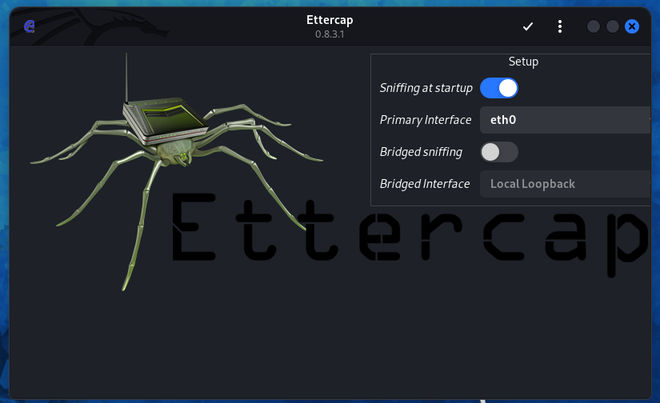
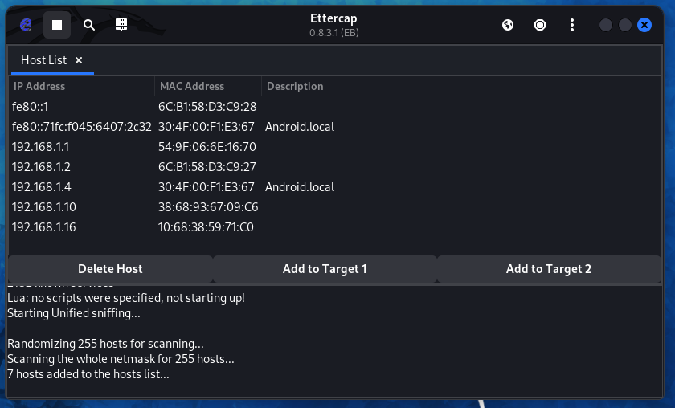
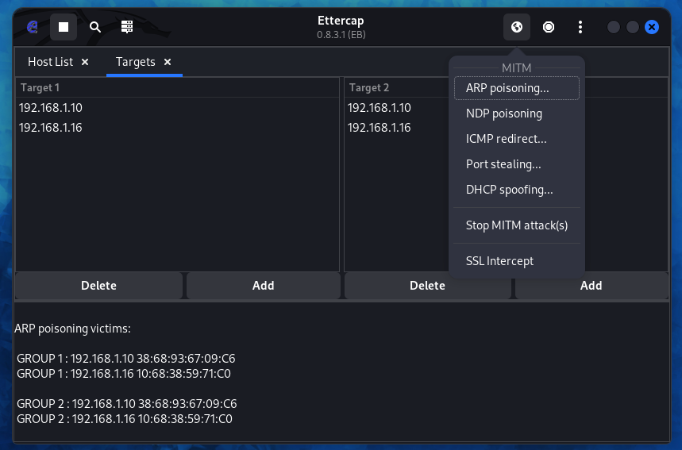
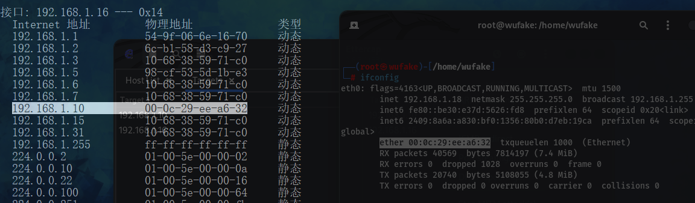

# ettercap
* ```
    Ettercap是一个流行的网络嗅探和中间人攻击工具，它用于分析和拦截网络流量，
    并允许攻击者进行各种攻击，如ARP欺骗、会话劫持、密码嗅探等。
## 使用演示
* 点击右上角的`√`开启 嗅探主机
* 
* 左上角 `终止嗅探`, `扫描主机`, `主机列表`, 右上角 `MITM 菜单`, `停止MITM攻击`, `Ettercap 菜单`,
* 
* 发起 `arp攻击`
* 
* `mac`值被篡改
* 
